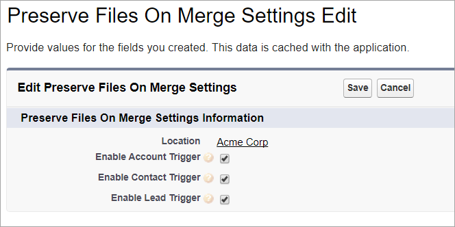
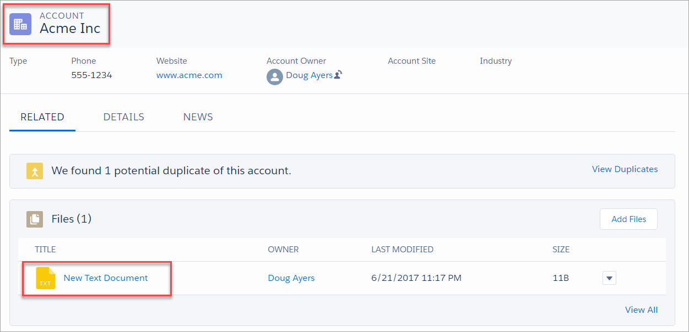
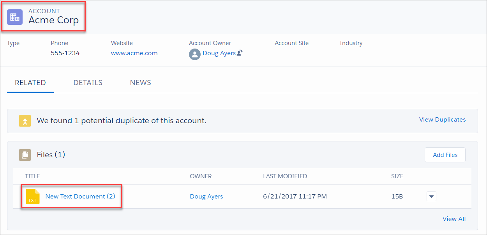
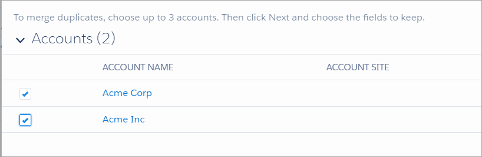
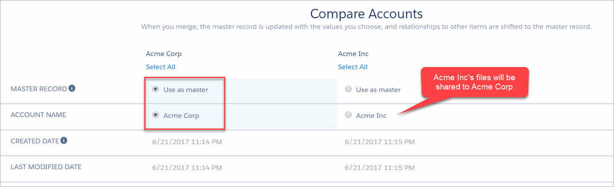
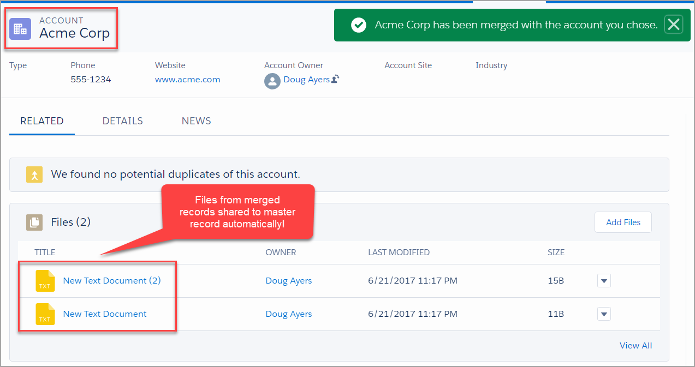

Preserve Related Files on Account, Contact, or Lead Merge
=========================================================

Overview
--------

Simple Account, Contact, and Lead triggers that move related Files to master record upon being merged.

As of this writing, Salesforce does not preserve Chatter or related Files during merge operation. The Files are left orphaned.

Inspired by [Gorav Seth](https://twitter.com/goravseth)'s realization of this on [Success Community](https://success.salesforce.com/0D53A00002uKsks),
I developed these simple triggers to demonstrate how to preserve and carry over the [Salesforce Files](https://developer.salesforce.com/docs/atlas.en-us.api.meta/api/sforce_api_objects_contentdocument.htm) to the master record post-merge.

Related Ideas:
* [Re-associated Related Files on Merged Accounts](https://success.salesforce.com/ideaView?id=0873A000000E7LCQA0)

Packaged Release History
========================

Release 1.1 (latest)
-----------
* Install package
  * [Production URL](https://login.salesforce.com/packaging/installPackage.apexp?p0=04tf40000004kVq)
  * [Sandbox URL](https://test.salesforce.com/packaging/installPackage.apexp?p0=04tf40000004kVq)
* Initial managed package offering

Installing the Source Code (Developers)
---------------------------------------

You may install the unmanaged code from GitHub and make any desired adjustments. You are responsible for ensuring unit tests meet your org's validation rules and other requirements.

* [Deploy from Github](https://githubsfdeploy.herokuapp.com)

Getting Started
---------------
1. Deploy the package using one of the installation links above.
2. By default, all three triggers for Account, Contact, and Lead objects are enabled. If you want to disable the merge logic at any time then navigate to custom setting **Preserve Files On Merge Settings** and toggle the desired trigger.
3. Go merge two or more Accounts, Contacts, or Leads that have related files.

An account with a file:

A duplicate account with different file:

Select accounts to merge:

Select master record:

Merge accounts and preserve related files:

